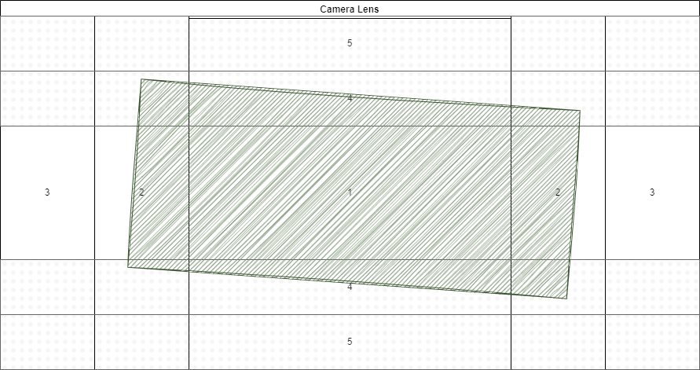
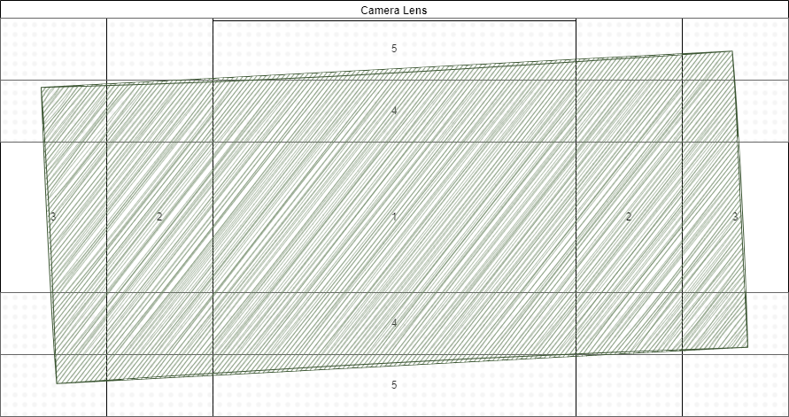

# Guessify Scanners

We tried using off the shelf barcode scanners. However, no dice.
We got [`barcode-detector`](https://github.com/Sec-ant/barcode-detector/) to work, but, this one doesn't support custom scanners.
We tried [`@ericblade/quagga2`](https://github.com/ericblade/quagga2), but, this required too much setup outside what we already had.
Thus, we decided to roll our own scanner.

We found [this article](https://boonepeter.github.io/posts/spotify-codes-part-2/) explaining how the Spotify codes work.
Since we we're planning to use the article and [it's repo](https://github.com/boonepeter/boonepeter.github.io-code/tree/main/spotify-codes-part-2) to build our own scanner for `quagga`, we can use it for our own crude scanner too.

## Finding the code

Normally, barcode scanners that use video support all kinds of orientations.  
We're planning on scanning inside of a rectangular lens, so only close to horizontal will be supported by our app,
making it quite a bit simpler to find it.

### Checking for a black rectangle

We'll need to find where the code is, but before we start scanning every frame for a Spotify code or trying to detect whether there even is a rectangle, we're going to scan an offset rectangle to detect if the center is mostly black.  
If no black, no scan. This should save some unnecessary scans.

  

As illustrated in `checking-the-average.drawio`, we'll divide the initial scan into 5 steps:

1. Check if the middle square (#1) is pimarily black, if no `end`  
1. Check if the first vertical section (#2) is primarily black, if yes `mark section black`, if no `go to 3`  
1. Check if the last vertical section (#3) is primarily black, if yes `end` (this means the whole screen is black)  
   Check if the section is somewhere in the gray, if yes `mark as gray` `go to 3`, if no `mark as empty` `go to 3`  
1. Check if the first horizontal section (#4) is primarily black, if yes `mark section black`, if no `go to 3`  
1. Check if the last horizontal section (#5) is primarily black, if yes `end` (this means the whole screen is black)  
   Check if the section is somewhere in the gray, if yes `mark as gray` `go to 3`, if no `mark as empty` `go to 3`  

We now have a rough estimate of where the screen is black and where it might be.  

Valid arrangements are:

`Small`

1. ⬛ black
1. 🔲 gray
1. ⬜ _empty_
1. 🔲 gray
1. ⬜ _empty_

`Large`

1. ⬛ black
1. ⬛ black
1. ⬛ black
1. 🔲 gray
1. 🔲 gray

  

Now, this is not a very forgiving approach. If the small version exists in the left bottom, for example, the scanner won't fire.  
For the initial version, this is fine.  
We can always add passes later if we find this doesn't work very well.  
Because some of the areas overlap we can skip checking the overlap. There's probably more optimizations we can make, but, since we might be breaking these passes up into individual squares later, we'll ignore that for v1.

### Finding the corners

`TODO`

### Scanning the code

`TODO`